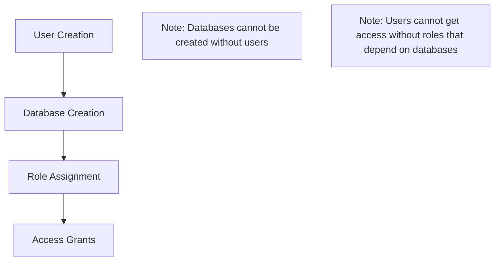

# Terraform-managed PostgreSQL Access Control

## Overview

This project provides Infrastructure as Code (IaC) management for PostgreSQL database access control across multiple instances and microservices. It was designed to handle the complexity of managing 3 PostgreSQL instances with 20 databases serving 50+ microservices, each requiring different levels of database access.

## Problem Statement

Managing database access across a large microservices architecture presents several challenges:

- **Scale**: Multiple PostgreSQL instances with numerous databases
- **Security**: Varying access control requirements per service
- **Automation**: Need for IaC approach to credential management
- **State Security**: Ensuring credentials are never stored in Terraform state

## Solution

This solution leverages the [PostgreSQL Terraform provider](https://registry.terraform.io/providers/cyrilgdn/postgresql) combined with AWS Secrets Manager to:

- Generate PostgreSQL user credentials securely
- Store credentials in a centralized secret manager
- Maintain zero credential exposure in Terraform state
- Automate database access provisioning

## Architecture

### Configuration Structure

The module accepts configuration maps that define users and database ownership:

```hcl
user = {
  main = { # PostgreSQL instance identifier
    database_owner_username = {
      access = [] # Database owner with no additional access needed
    }
    postgres_username = {
      access = ["read_database_name", "write_database_name"] # User with specific role-based access
    }
  }
}

database_owner = {
  main = { # PostgreSQL instance identifier
    database_name = "database_owner_username"
  }
}
```

### Resource Creation Flow



**Important Dependencies:**

- Databases cannot be created without users
- Users cannot receive access grants without roles that require the database to exist first

## Implementation Details

### Credential Management Workflow

The system uses AWS Secrets Manager for secure credential storage with the following process:

1. **AWS Role Assumption**: Assume the appropriate AWS IAM role
2. **Secure Connection**: Establish SSH tunnel using AWS Systems Manager (SSM)
3. **Secret Generation**: Create random password using AWS Secrets Manager
4. **Secret Storage**: Store credential in AWS Secrets Manager at `rds/application/postgres-username` allowing the application to pick it up without any additional configuration
5. **User Creation**: Provision the PostgreSQL user with the stored credential

### Security Benefits

- **Zero State Exposure**: No credentials stored in Terraform state files
- **Centralized Management**: All secrets managed through AWS Secrets Manager
- **Automated Rotation**: Supports credential rotation workflows
- **Audit Trail**: Full logging of credential access and modifications

## Frequently Asked Questions

### Q1: Why not use the terraform provider's [postgresql_role resources](https://registry.terraform.io/providers/cyrilgdn/postgresql/1.25.0/docs/resources/postgresql_role)?

**A1**: At the time of implementation, the provider did not support write-only password functionality and would persist passwords in the Terraform state, creating a security vulnerability.

### Q2: Why is the password stored in Secrets Manager before user creation?

**A2**: This order prevents credential loss scenarios. If we created the user first and then the Secrets Manager storage failed, we would lose the password and require manual intervention. The current approach ensures password availability before user creation.
