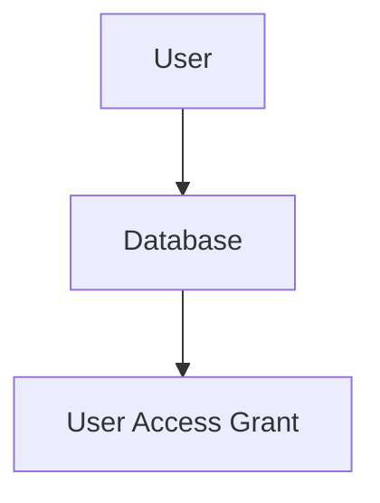

# Terraform-managed PostgreSQL access control

## Purpose

This was needed, as we were running 3 PostgreSQL instances with 20 databases across 50+ microservices.
Each service needs to access multiple databases with varying access control.
To do this in an IaC manner, I found this Postgres Terraform provider. With the correct permission, we could generate Postgres user credentials and store them in the shared secret manager while making sure no credentials are stored in the Terraform state.

## How it was actually implemented

### Configuration

We were using maps which were passed to the module.
Inside the module the resources using these configurations to do the actual resource generation.

The configurations passed to the module:

```hcp
user = {
  main = { # this is the key for the postgresql instance to target
    database_owner_username = {access = []} # This was is only a database owner and does not need access to another database
    postgres_username = {access = ["read_database_name","write_database_name"]} # these were roles given to the user to access databases it did not own. These roles were automatically generated after the database was created
  }
}

database_owner = {
  main = { # this is the key for the postgresql instance to target
    database_name = "database_owner_username" 
  }
}
```

### Resource creation flow



database can not be created without users

users can not get access without roles which need the database

### Credentials generation and sharing

We used AWS secret manger for secret management.
When a new user is created we run a script which will do the following:

1. Assume the correct AWS role
2. Setup an SSH tunnel using AWS SSM
3. Generate random secret using the AWS secret manger tool.
4. Store/Update the secret in AWS secret manger at `rds/application/postgres-username`
5. Generate the PostgreSQL user.

#### QnA
Q1. Why do this and not use the terraform provider's [postgresql_role rsources](https://registry.terraform.io/providers/cyrilgdn/postgresql/1.25.0/docs/resources/postgresql_roleresources/postgresql_role)?
A. At that time provider did not support write only password and would save the password the terraform state.

Q2. Why is the password first stored in the secret manger and then user created?
A. This was done if the order was the other way around and the secret manger store step failed after the user was created then we would lose the password and would need manual intervention whereas right now that is not the case