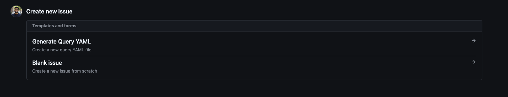
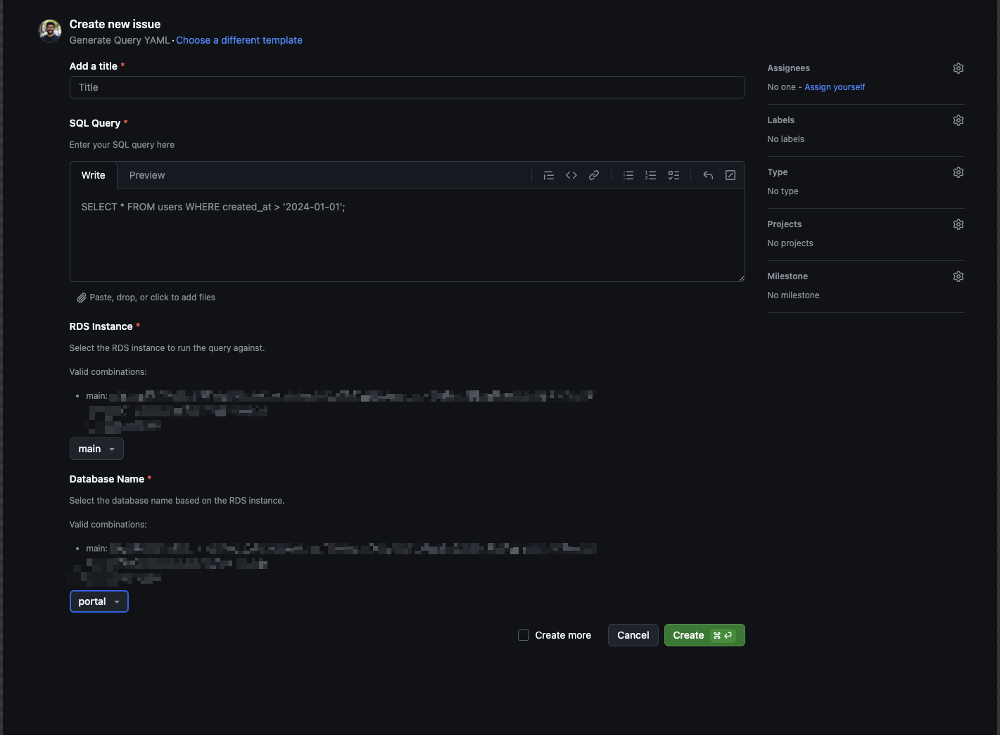

# Terraform-managed PostgreSQL secure Git-managed query runner

## Purpose

This is a project created out of the need to run queries in the production database in a secure tracked manner, such as indexing, feature flags, etc.

We used the following intriguing things:

- `terraform_data` resource and terraform state to manage the queries that have already been run successfully.
- AWS SSM for a secure ssh connection to the database
- The GitHub issue template is designed to collect essential information from the developer, including the database name, PostgreSQL instance name, and query code.
- A GitHub action is used to generate the query code, add the query, create a pull request (PR) for it, and send a Slack notification to the team, which could enable this query to run in production.
- The benefit of this system is that all approvals and interactions are conducted and tracked on GitHub; additionally, this flow allows for the entire process to run in the background without requiring any interaction with Terraform.

## Base structure of the workspace

```
.
├── enviroment
│   ├── data.tf
│   ├── locals.tf
│   ├── provider.tf
│   └── queries
│       ├── 1234.yaml
│       ├── asdfjka.yaml
│       ..
└── terraform-modules
    └── query
        ├── main.tf
        ├── providers.tf
        ├── run.sh
        └── variables.tf
```

- There is 1 invocation of the module query per queries file
- We will only be using `terraform_data` resource for this as we only need to track the following:
  - Output of the query
  - If the query was successful
- The plan time is almost constant as the provider calls no not scale with the number of queries.
- This is similar to tracking if a shell query was success of not and storing that information in terraform state

## Developer Experience

1.
<figure>

<figcaption>New Issue</figcaption>
</figure>
2.
<figure>

<figcaption>Issue Input</figcaption>
</figure>

## Post Issue Creation

Once an issue has been created we do the following steps using GitHub actions.

1. Extract and validate information from the issue
2. Create a random name YAML file in the `queries folder`
3. Create a branch with the random name and commit the file.
4. Create a PR for this branch.
5. Send a Slack Notification

Once the PR is created a new GitHub action runs to comment the plan in the PR, so the appropriate user can read the comment and approve the PR.

